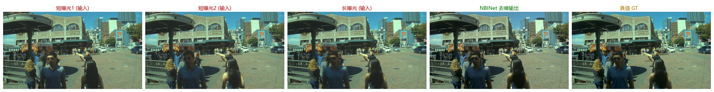
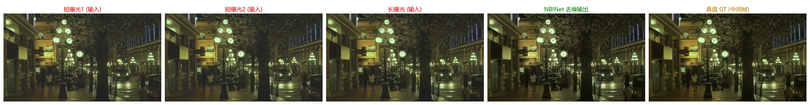

# NightBurstImage · 暗光图像实时增强与车牌识别系统

> 基于飞凌 **ELF2（瑞芯微 RK3588）** 开发板的端侧 AI 视觉系统：以 RAW 相机采集夜间/低照度图像，经 **NPU 实时去噪增强** 后进行 **车牌检测与识别**，结果实时显示到 MIPI 屏，并通过板载 WiFi 提供手机端查询。全流程运行于边缘端，**无需联网、无需 PC，上电即用**。

<p align="center">
  <em>2026 全国大学生嵌入式芯片与系统设计竞赛 · 瑞芯微赛题（选题方向二：端侧 AI 视觉应用）</em>
</p>

---

##  效果演示

| 处理前（原始短曝光） | 处理后（NBINet 去噪） |
|:---:|:---:|
|  |  |

> 更多演示：`docs/` 下的去噪流程对比图、车牌识别截图、手机查询界面。
##  效果演示

| 硬件系统 | 板端暗室实测 | 实时成像效果 |
|:---:|:---:|:---:|
|  |  |  |

| PC端去噪增强算法效果1 | PC端去噪增强算法效果2 | Web端查询界面 |
|:---:|:---:|:---:|
|  |  |  |

> 以上图片均来自 `tmp/` 目录，分别展示了硬件搭建、暗光实测、实时成像、算法增强效果和 Web 查询界面。

---

##  项目简介

夜间及低照度下，普通摄像头成像噪声大、细节丢失，车牌等关键信息难以辨认。本项目：

- **RAW 域多帧融合去噪**：借鉴 [D2HNet](https://github.com/zhaoyuzhi/D2HNet) 的“短-长-短”三帧融合思路，自研 **NBINet** 网络直接在 12-bit RAW Bayer 域端到端去噪增强；
- **面向 NPU 的算子改造**：将 DWT/IWT 小波变换、DCN 等 NPU 不友好算子替换为 Conv2d / PixelShuffle 等原生算子，使模型能在 RK3588 NPU 上 **FP16** 高效加速；
- **NPU + CPU 异构并行**：去噪跑在 NPU，车牌识别（[HyperLPR3](https://github.com/szad670401/HyperLPR)：YOLO 检测 + CTC 识别）经 ncnn 跑在 CPU，两者并行；
- **端侧闭环**：相机 → 去噪 → 识别 → MIPI 显示 + 手机 Web 查询，全 C 多线程实现。

---

##  系统架构

```
                    ┌── 显示线程 (DRM/KMS) ──► MIPI 屏 1024×600
相机(RAW)            │
  │ USB2             │
  ▼                  │
采集线程 ──► [RAW环形缓冲] ──► 去噪线程 (NBINet @ NPU, FP16)
(Bayer→RGGB)                        │  去噪RGB
                                    ├──► 显示环形缓冲 ──► 显示线程
                                    └──► 识别环形缓冲 ──► 识别线程 (HyperLPR3 @ CPU/ncnn)
                                                              │  车牌号+抓拍图
                                                              ▼
                                                   plates.txt / *.bmp
                                                              │
                                                   lpr_server (HTTP) ──WiFi──► 手机浏览器查询
```

四线程通过环形缓冲解耦，去噪与识别各自消费全部帧，互不阻塞。

---

##  目录结构

| 目录 | 说明 |
|------|------|
| [`NBInet/`](NBInet/) | 去噪模型训练、数据加载、导出（PyTorch → ONNX → RKNN） |
| [`pipeline/core/`](pipeline/core/) | 板端主管线：相机采集 / NPU 去噪 / DRM 显示 / 环形缓冲 + `Makefile` |
| [`pipeline/lpr/`](pipeline/lpr/) | 车牌检测 + 识别模块（YOLO + CTC，ncnn） |
| [`pipeline/tools/`](pipeline/tools/) | Web 查询服务（`lpr_server`）+ 相机诊断工具（`asi_snap` / `asi_stream`） |
| [`pipeline/lib/`](pipeline/lib/) | 运行库（ASI 相机 SDK、libusb） |
| [`pipeline/board_config/`](pipeline/board_config/) | 板端配置（开机自启脚本等） |
| `archive/` | 早期探索代码归档（不参与构建） |

---

##  硬件要求

- 飞凌 **ELF2** 开发板（RK3588，Linux 5.10.209 / Buildroot）
- **MIPI DSI** 显示屏（1024×600）
- **ZWO ASI585MC**（Sony IMX585，12-bit RAW）USB 相机 —— 接 **USB2** 口
- 板载 CF-AX200 WiFi（手机查询用）

> 注：RK3588 的 USB3（xHCI/DWC3）在持续流传输下存在稳定性问题，相机需接 USB2 口。

---

##  编译（在 x86 Linux 交叉编译）

```bash
cd pipeline/core

# 配置工具链与依赖路径
export SDK=<aarch64-buildroot-linux-gnu 工具链根目录>
export RKNN_API=<librknn_api 路径>
export NCNN_ROOT=<ncnn 编译产物路径>
export ASI_SDK=<ASI Camera SDK 路径>

make              # 生成 pipeline (主程序)
make lpr_server   # 生成 lpr_server (Web 查询服务)
make asi_stream   # 可选: 相机/USB 诊断工具
```

##  部署与运行（板端）

**1. 拷贝二进制、运行库与模型到板子：**

```bash
scp pipeline lpr_server root@<板子IP>:/tmp/
scp pipeline/lib/*.so.*  root@<板子IP>:/mnt/sdcard/    # 首次: ASI SDK / libusb
# 模型放到 /mnt/sdcard/:
#   nbinet_272x480.rknn                 (去噪 NPU 模型)
#   y5fu_320x_sim.ncnn.{param,bin}      (车牌检测)
#   rpv3_mdict_160_r3.ncnn.{param,bin}  (车牌识别)
#   litemodel_cls_96x_r1.ncnn.{param,bin} (单双层分类)
```

**2. 板端运行：**

```bash
export LD_LIBRARY_PATH=/tmp:/mnt/sdcard:$LD_LIBRARY_PATH

# Web 查询服务 (后台)
/tmp/lpr_server 8080 /mnt/sdcard/plates &

# 主管线 (相机接 USB2)
/tmp/pipeline --model /mnt/sdcard/nbinet_272x480.rknn \
              --lpr   /mnt/sdcard \
              --output /mnt/sdcard/plates
```

**3. 手机查询：** 手机连同一 WiFi，浏览器打开 `http://<板子IP>:8080`，即可按车牌归组查看识别记录、抓拍图与时间，并支持车牌号搜索。

---

##  性能指标

| 指标 | 参数 |
|------|------|
| 主控 | RK3588（4×A76 + 4×A55，6 TOPS NPU） |
| 去噪模型 | NBINet（基于 D2HNet 改造），三帧 RAW 融合，FP16 |
| 去噪精度 | 验证集 PSNR 35.0 dB / SSIM 0.924 |
| 去噪速度 | ~120 ms/帧（~8 fps，NPU） |
| 车牌识别 | ~40–60 ms/帧（ncnn，CPU，与 NPU 并行） |
| 显示 | MIPI DSI 1024×600，DRM/KMS 直显 |
| 端到端 | ~8 fps，实测无丢帧 |

---

##  致谢

本项目基于以下优秀开源工作：

- [D2HNet](https://github.com/zhaoyuzhi/D2HNet) — 双短一长三帧 RAW 融合去噪框架
- [HyperLPR3](https://github.com/szad670401/HyperLPR) — 中文车牌识别
- [ncnn](https://github.com/Tencent/ncnn) — 端侧神经网络推理框架
- [RKNN-Toolkit2](https://github.com/airockchip/rknn-toolkit2) — RK3588 NPU 模型部署


