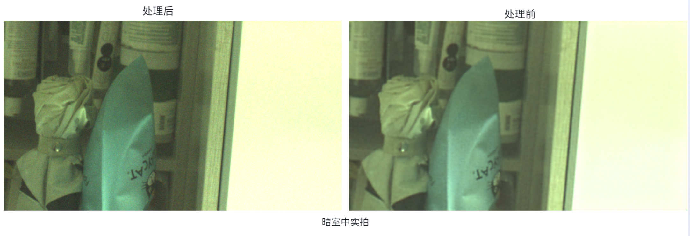
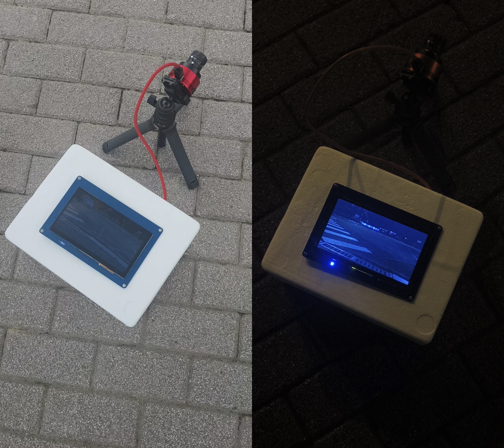
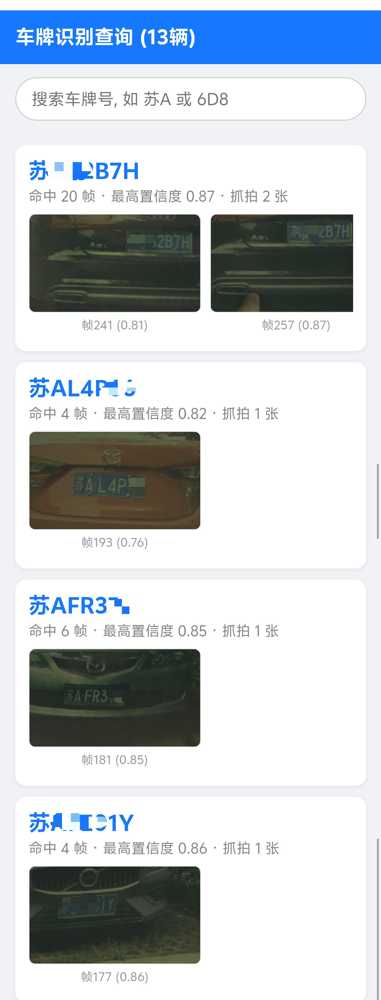
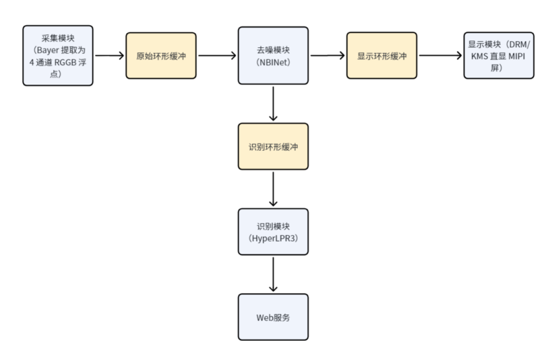

 # NightBurstImage · 暗光图像实时增强与车牌识别系统

基于飞凌 ELF2（瑞芯微 RK3588）开发板的端侧 AI 视觉系统：以 RAW 相机采集夜间/低照度图像，经 NPU 实时去噪增强后在 CPU 进行车牌检测与识别，去噪结果实时显示到 MIPI 屏，并通过板载 WiFi 提供手机端查询。全流程运行于边缘端，无需联网、无需 PC，上电即用。

**[项目设计书 PDF](report.pdf)**（1.7 MB）

## 效果演示

**[观看演示视频](docs/demo.mp4)**（3 分钟 · H.264 · 41 MB）—— 推荐下载后播放以获得完整画质与音轨。

硬件系统


板端暗室实测



实时成像效果



PC端去噪增强算法效果1


PC端去噪增强算法效果2


Web端查询界面



## 数据集下载

[`final_dataset.tar.gz`](https://pan.baidu.com/s/1JAN0ICNXZUZWwl9aJzcy7Q?pwd=2ydb)，提取码 `2ydb`。

提示：下载并解压后请确认数据集完整性与使用许可（仅用于研究/内部测试）。解压示例：

```bash
tar xzf final_dataset.tar.gz
# 解压后可能包含 images/ 和 annotations/ 等目录，具体以压缩包内结构为准
ls -l final_dataset/
```

## 项目简介

夜间及低照度下，普通摄像头成像噪声大、细节丢失，车牌等关键信息难以辨认。本项目：

- **RAW 域多帧融合去噪**：借鉴 [D2HNet](https://github.com/zhaoyuzhi/D2HNet) 的“短-长-短”三帧融合思路，自研 **NBINet** 网络直接在 12-bit RAW Bayer 域端到端去噪增强；
- **面向 NPU 的算子改造**：将 DWT/IWT 小波变换、DCN 等 NPU 不友好算子替换为 Conv2d / PixelShuffle 等原生算子，使模型能在 RK3588 NPU 上 **FP16** 高效加速；
- **NPU + CPU 异构并行**：去噪跑在 NPU，车牌识别（[HyperLPR3](https://github.com/szad670401/HyperLPR)：YOLO 检测 + CTC 识别）经 ncnn 跑在 CPU，两者并行；
- **端侧闭环**：相机 → 去噪 → 识别 → MIPI 显示 + 手机 Web 查询，全 C 多线程实现。

## 系统架构



四线程通过环形缓冲解耦，去噪与识别各自消费全部帧，互不阻塞。

## 目录结构

| 目录 | 说明 |
|------|------|
| [`models/`](models/) | **部署模型**：去噪 rknn + 车牌 ncnn（拷到板子即可运行，~10 MB） |
| [`NBInet/`](NBInet/) | 去噪模型训练、数据加载、导出（PyTorch → ONNX → RKNN） |
| [`pipeline/core/`](pipeline/core/) | 板端主管线：相机采集 / NPU 去噪 / DRM 显示 / 环形缓冲 + `Makefile` |
| [`pipeline/lpr/`](pipeline/lpr/) | 车牌检测 + 识别模块（YOLO + CTC，ncnn） |
| [`pipeline/tools/`](pipeline/tools/) | Web 查询服务（`lpr_server`）+ 相机诊断工具（`asi_snap` / `asi_stream`） |
| [`pipeline/lib/`](pipeline/lib/) | 运行库（ASI 相机 SDK、libusb） |
| [`pipeline/board_config/`](pipeline/board_config/) | 板端配置（开机自启脚本等） |
| `archive/` | 早期探索代码归档（不参与构建） |

## 硬件要求

- 飞凌 **ELF2** 开发板（RK3588，Linux 5.10.209 / Buildroot）
- **MIPI DSI** 显示屏（1024×600）
- **ZWO ASI585MC**（Sony IMX585，12-bit RAW）USB 相机 —— 接 **USB2** 口
- 板载 CF-AX200 WiFi（手机查询用）


## 快速上手 (Quick Start)

以下为最小复现流程（板端已编译二进制且已将模型放到 `/mnt/sdcard` 的前提）。

1) 在开发机将二进制与模型拷贝到板子：

```bash
scp pipeline lpr_server root@<BOARD_IP>:/tmp/
scp pipeline/lib/*.so.* root@<BOARD_IP>:/mnt/sdcard/   # 首次: ASI SDK / libusb
scp models/denoise/* models/lpr/* root@<BOARD_IP>:/mnt/sdcard/   # 去噪 rknn + 车牌 ncnn 模型 (见 models/)
```

2) 在板子上运行：

```bash
export LD_LIBRARY_PATH=/tmp:/mnt/sdcard:$LD_LIBRARY_PATH
/tmp/lpr_server 8080 /mnt/sdcard/plates &
/tmp/pipeline --model /mnt/sdcard/nbinet_272x480_fp16.rknn --lpr /mnt/sdcard --output /mnt/sdcard/plates
```

3) 打开浏览器访问 `http://<BOARD_IP>:8080` 查看识别结果。

## 编译（在 x86 Linux 交叉编译）

```bash
cd pipeline/core

# 配置工具链与依赖路径
export SDK=<aarch64-buildroot-linux-gnu 工具链根目录>
export RKNN_API=<librknn_api 路径>
export NCNN_ROOT=<ncnn 编译产物路径>
export ASI_SDK=<ASI Camera SDK 路径>

make              # 生成 pipeline (主程序)
make lpr_server   # 生成 lpr_server (Web 查询服务)
make asi_stream   # 可选: 相机/USB 诊断工具
```

示例环境变量（仅供参考）：

```bash
export SDK=/opt/gcc/aarch64-buildroot-linux-gnu
export NCNN_ROOT=/home/user/ncnn/build/install
export RKNN_API=/home/user/rknn_api
```

## 模型导出

`NBInet/export/export_to_onnx.py` 会把训练好的 PyTorch 权重导出为 ONNX，输入为两路 RAW：`short_cat` 为两帧短曝光拼接，`long_raw` 为长曝光输入。

```bash
cd NBInet

python export/export_to_onnx.py \
    --model_path snapshot/nbinet_imx585/GNet/GNet-epoch-199.pkl \
    --output_path export/nbinet.onnx \
    --height 544 --width 960
```

然后用 `NBInet/export/convert_to_rknn.py` 转成 RKNN：

```bash
python export/convert_to_rknn.py \
    --onnx_path export/nbinet.onnx \
    --output_path export/nbinet.rknn \
    --calib_dir data/raw/val \
    --target rk3588
```

提示：INT8 量化需要校准数据，脚本支持场景目录或单个 `.npy` 样本自动生成校准集。

## 训练复现

`NBInet/train.py` 是训练入口，默认读取 `options/nbinet.yaml`：

```bash
cd NBInet
python train.py --opt options/nbinet.yaml --num_gpus 1 --save_path snapshot/nbinet --log_path log_pt/nbinet
```

如果需要切换数据集或蒸馏配置，可改用 `options/nbinet_imx585.yaml` / `options/nbinet_distill.yaml`。

## 部署与运行（板端）

**1. 拷贝二进制、运行库与模型到板子：**

```bash
scp pipeline lpr_server root@<板子IP>:/tmp/
scp pipeline/lib/*.so.*  root@<板子IP>:/mnt/sdcard/    # 首次: ASI SDK / libusb
# 模型放到 /mnt/sdcard/:
#   nbinet_272x480.rknn                  (去噪 NPU 模型)
#   y5fu_320x_sim.ncnn.{param,bin}       (车牌检测)
#   rpv3_mdict_160_r3.ncnn.{param,bin}   (车牌识别)
#   litemodel_cls_96x_r1.ncnn.{param,bin} (单双层分类)
```

**2. 板端运行：**

```bash
export LD_LIBRARY_PATH=/tmp:/mnt/sdcard:$LD_LIBRARY_PATH

# Web 查询服务 (后台)
/tmp/lpr_server 8080 /mnt/sdcard/plates &

# 主管线 (相机接 USB2)
/tmp/pipeline --model /mnt/sdcard/nbinet_272x480.rknn \
                            --lpr   /mnt/sdcard \
                            --output /mnt/sdcard/plates
```

运行时 `--lpr <DIR>` 参数期望一个目录（例如 `/mnt/sdcard`），`--output <DIR>` 指向 plates 输出目录（默认示例中为 `/mnt/sdcard/plates`）。板端会在该目录下生成 `plates.txt`（逐行追加）与抓拍图片（jpg），`lpr_server` 使用该 `plates.txt` 作为数据源。

`plates.txt` 每行示例格式：

```text
frame=63 ts=1234 plate=苏A6D8F8 type=蓝牌(0) conf=0.74 img=cap_63.jpg yolo_ms=.. lpr_ms=..
```

因此部署时请确保 `/mnt/sdcard/plates/` 目录可写且有足够空间。可选脚本 `archive/scripts/query_plates.py` 可用于从 PC 端查看 `plates.txt`。

**3. 手机查询：** 手机连同一 WiFi，浏览器打开 `http://<板子IP>:8080`，即可按车牌归组查看识别记录、抓拍图与时间，并支持车牌号搜索。

## 性能指标

| 指标 | 参数 |
|------|------|
| 主控 | RK3588（4×A76 + 4×A55，6 TOPS NPU） |
| 去噪模型 | NBINet（基于 D2HNet 改造），三帧 RAW 融合，FP16 |
| 去噪精度 | 验证集 PSNR 35.0 dB / SSIM 0.924 |
| 去噪速度 | ~120 ms/帧（~8 fps，NPU） |
| 车牌识别 | ~40–60 ms/帧（ncnn，CPU，与 NPU 并行） |
| 显示 | MIPI DSI 1024×600，DRM/KMS 直显 |
| 端到端 | ~8 fps，实测无丢帧 |

注：上述性能在 RK3588 开发板上测得；具体数值受 NPU/CPU 频率、模型版本、输入分辨率与系统负载影响。去噪与识别延时为流水线并行项，端到端 FPS 以主循环输出为准。

## 致谢

本项目基于以下优秀开源工作：

- [D2HNet](https://github.com/zhaoyuzhi/D2HNet)
- [HyperLPR3](https://github.com/szad670401/HyperLPR)
- [ncnn](https://github.com/Tencent/ncnn)
- [RKNN-Toolkit2](https://github.com/airockchip/rknn-toolkit2)


